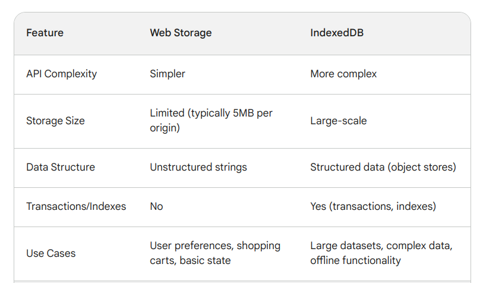

34 	What is IndexedDB
35 	What is web storage
36 	What is a post message

IndexedDB 
IndexedDB is a powerful client-side storage system built into web browsers. 
It allows you to store large amounts of structured data directly within the user's browser,
 even beyond what's possible with local storage or cookies. 
 This data persistence enables features like offline functionality and saving user 
 preferences across sessions.

In summary, IndexedDB is a valuable tool for web developers who need to store and manage large amounts of structured data on the client-side. It offers offline functionality, improved performance, and p ersistence capabilities that can enhance the user experience of your web applications.

Benefits of Using IndexedDB:
1.Offline Functionality:
2.Improved Performance:
3.Complex Data Management:
4.Persistent User Data: 

web Storgae 

Web storage refers to client-side mechanisms provided by web browsers that allow websites to store data locally on a user's device. This data storage persists between page loads for the same origin (domain and protocol) but is separate from browser cookies. There are two main types of web storage:

Local Storage:

Data stored in local storage has no expiration date and persists until explicitly cleared by the user or the browser (usually through settings or by the website itself).
It's suitable for data that needs to be available for extended periods, such as user preferences, application state, or frequently accessed information.

Session Storage:

Data stored in session storage is only available for the current browsing session. Once the user closes the browser tab or window, the data is cleared.
This type of storage is useful for temporary data that needs to persist within a session but doesn't require long-term persistence, like shopping carts or form data.

Benefits of Web Storage:

Improved Performance: By storing data locally, web applications can reduce the number of requests to the server, leading to faster loading times and a more responsive user experience.
Offline Functionality: In some cases, web storage can enable basic offline functionality. Critical data or cached resources can be stored locally and accessed even when the user is offline.
Persistent User Experience: Web storage allows you to save user preferences and application state, providing a more personalized and consistent user experience across sessions.

post message 

In JavaScript, a post message (also known as window.postMessage) is a method that enables communication between different windows, frames (iframes), or tabs within the same origin (domain, protocol, and port). This allows web pages to exchange data securely and dynamically.

