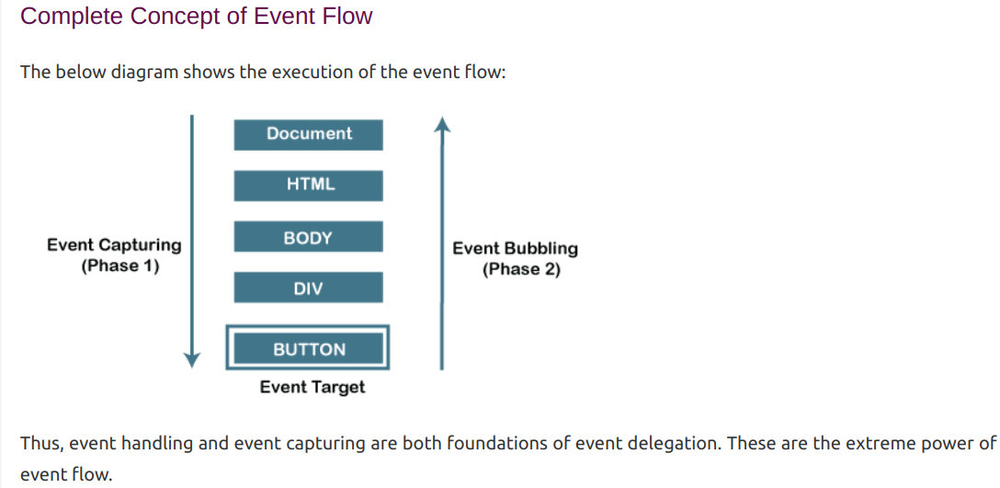

what are events


In web development and JavaScript programming, **events** are actions or occurrences that happen in the browser or within a web page. They can be triggered by various factors, including:

* **User Interactions:** Mouse clicks, keyboard presses, mouse movements, form submissions, touch events on mobile devices, etc.
* **Browser Actions:** Page loading, resizing the browser window, scrolling, errors, etc.
* **Network Activity:** Completing a network request, receiving data from a server, etc.
* **Other:** Timer expirations, changes in the Document Object Model (DOM), etc.

**Why Events Are Important:**

Events are crucial for building interactive and dynamic web applications. They allow your JavaScript code to react to user actions and other changes in the environment, making your web pages more engaging and responsive.

**How Events Work:**

1. **Event Occurs:** An action or change triggers an event.
2. **Event Detected:** The browser (or other JavaScript environment) detects the event.
3. **Event Dispatched:** The browser creates an event object that contains information about the event (e.g., type of event, target element, timestamp).
4. **Event Handler Called:** If an event listener has been registered for that specific event, the browser calls the associated event handler function.
5. **Code Executes:** The event handler function runs your JavaScript code to respond to the event.

**Event Handlers:**

* **Event Listeners:** Functions that you register to "listen" for specific events. When the event occurs, the listener is triggered.
* **Event Attributes:** In HTML, you can attach event handlers directly to elements using attributes like `onclick`, `onmouseover`, etc.
* **`addEventListener()` Method:**  In JavaScript, you can attach multiple event listeners to an element using the `addEventListener()` method, giving you more flexibility.

**Example:**

```javascript
// Using an event attribute in HTML
<button onclick="alert('Button clicked!')">Click Me</button>

// Using addEventListener() in JavaScript
document.getElementById('myButton').addEventListener('click', () => {
    alert('Button clicked!');
});
```

**Common Events:**

* **Mouse Events:** `click`, `dblclick`, `mousedown`, `mouseup`, `mouseover`, `mouseout`, `mousemove`
* **Keyboard Events:** `keydown`, `keyup`, `keypress`
* **Form Events:** `submit`, `change`, `focus`, `blur`
* **Document/Window Events:** `load`, `unload`, `resize`, `scroll`, `DOMContentLoaded`
* **Touch Events (Mobile):** `touchstart`, `touchmove`, `touchend`


In JavaScript, propagation of events is done, which is known as 'Event Flow'. Event Flow is the sequence or order in which the particular web page receives the event. Thus, in JS, the process of event flow depends on the three aspects, which are:

                                Event Capturing
                                Event Target
                                Event Bubbling

Event bubbling 


The image demonstrates the complete concept of event flow in JavaScript. The event flow has two main phases:

1. **Event Capturing (Phase 1):** The event starts at the root of the DOM (the `Document` object in this case) and travels down the hierarchy to the target element (the `BUTTON`). Each ancestor element along the way has a chance to handle the event before it reaches the actual target.

2. **Event Bubbling (Phase 2):**  After the event is handled by the target element, it "bubbles up" the DOM hierarchy, allowing each of its ancestor elements to also handle the event. In the image, the event would then go from the `BUTTON` to `DIV`, then `BODY`, `HTML`, and finally back to the `Document` object.

**Event Target:** This is the specific element where the event originated (the `BUTTON` in this case).

**Key Points:**

* **Event Delegation:** By understanding event flow, you can implement efficient event delegation. This means attaching an event listener to a parent element and handling events for all its descendants in one place.
* **Extreme Power:** The image suggests that event capturing and bubbling are powerful concepts that enable sophisticated event handling strategies in web development.
* **Default Behavior:** By default, most events bubble up the DOM. However, you can control the event flow with `event.stopPropagation()` to stop bubbling and use capturing if needed.

Let me know if you'd like more details on how to use these concepts in practice or any other aspect of event handling!
